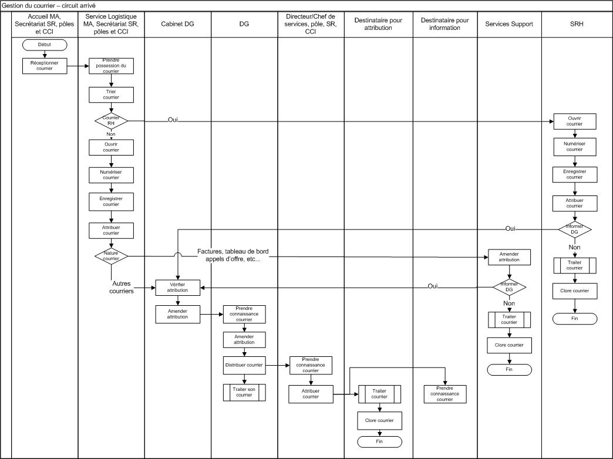
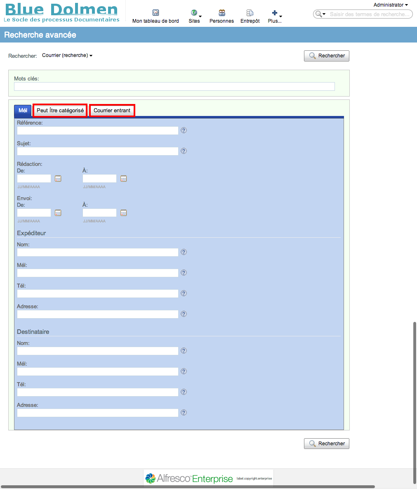
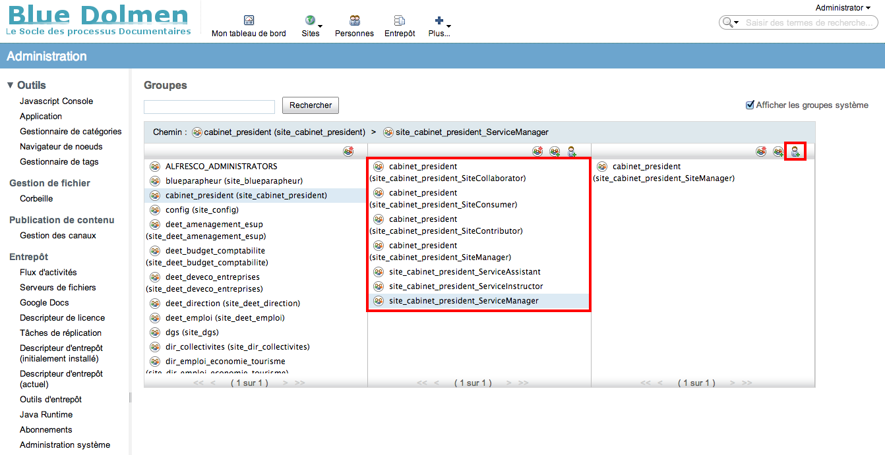

\

\

\

\

**Date de rédaction**

**18/11/2013**

**Auteur**

**Jean-Christophe KERMAGORET**

**Référence**

**GECOD\_DSE\_Courrier\_20131118\_v2.0.0trav**

\

\
\

Liste de diffusion

**ANFR**

\

**BlueXML**

Christian DUCHÉ

\

bx.anfr@bluexml.com

Khaled BEN-MOHAMED

\

\

Hélène AUDIBERT

\

\

\
\

**Suivi des Modifications**

**Version document**

**Date**

**Changement**

**Auteurs**

1.0

09/10/2013

*Rédaction de la version 1*

JCK (BlueXML)

1.1

16/10/2013

*Relecture par ANFR (DA)*

Hélène Audibert\
(ANFR)

1.2

22/10/2013

*Relecture par ANFR (CP)*

Khaled BEN-MOHAMED\
(ANFR)

2.0

18/11/2013

*Rédaction de la version 2*

JCK (BlueXML)

**SOMMAIRE**

Sommaire

[1 Introduction 3](#__RefHeading__12432_1613847311)

[2 Concepts 3](#__RefHeading__16085_1613847311)

[3 Données 5](#__RefHeading__47594_366714447)

[4 Processus 8](#__RefHeading__47596_366714447)

[5 Fonctions 17](#__RefHeading__32561_366714447)

[6 Intégration 33](#__RefHeading__12438_1613847311)

\
\

\
\

1Introduction {.western style="page-break-before: always"}
=============

Blue Courrier est le logiciel de gestion de courrier développé par
BlueXML. Cet outil est destiné à assister les utilisateurs manipulant du
courrier afin d'améliorer son suivi et sa traçabilité.

Ce D.S.E est celui de l’adaptation du logiciel Blue Courrier à
l’environnement de l’ANFR dans le cadre du projet GECOD. Les captures
d'écran reflètent l'état des développements à aujourd'hui et ne
correspondent donc pas au résultat final. Celui-ci peut être imaginé en
ajoutant aux captures d'écran les descriptions textuelles des
différentes fonctions.

2Concepts {.western}
=========

2.1Acteurs {.western}
----------

Blue Courrier définit 3 groupes d'utilisateur :

-   Assistant : distribue le courrier et l'assigne à un instructeur

-   Instructeur : décide de rédiger une réponse, la rédige puis la fait
    valider

-   Responsable : valide une réponse au courrier et la fait
    éventuellement valider par un autre responsable

Blue Courrier fonctionnant sur la notion de site Alfresco Share, les
groupes ci-dessus s'ajoutent aux groupes Alfresco Share qui sont au
nombre de 4. Les sites Blue Courrier auront donc 7 groupes.

2.2Service {.western}
----------

Blue Courrier fait circuler le courrier par service, réel ou virtuel (on
peut ainsi créer des sites pour des services n'existant pas mais jouant
un rôle au niveau de la gestion du courrier ou de la GED). Un service
correspond à un site Alfresco Share. Une organisation en
Pôle/Direction/Service aura ainsi autant de sites Alfresco Share que de
strates organisationnelles.

Il peut être attribué une gestion de courrier à tous les sites
choisissant d’en recevoir (par paramétrage de l’administrateur Alfresco
) au moment de la création ou par la suite, par l'intermédiaire d'un
script. Le nom du 'service' apparaissant dans l’interface Blue
Courrier est le nom du site.

Les sites existant dans la partie GED de GECOD (Alfresco) ou ceux créés
dans l’avenir pourront donc bénéficier de cette possibilité.

Plusieurs personnes peuvent avoir le même rôle sur le même site.

### 2.2.1Services avec une fonction particulière {.western}

Dans le cadre de la gestion de courrier pour l'ANFR, certains services
jouent un rôle particulier :

-   service logistique : il centralise les courriers entrants dans
    l'organisation et préparer leut distribution

-   le cabinet 'DG': il valide la distribution des courriers qu'elle ne
    soit effective au niveau des services

#### 2.2.1.1Service Logistique {.western}

Ce service centralise les courriers entrants dans l'organisation. Le
nombre de courriers est donc maximal dans ce service : il faut gagner du
temps pour ne pas retarder la distribution.

Le courrier est extrait des enveloppes, le contenu de chaque enveloppe
étant séparé du précédent par un intercalaire comportant :

-   un code barre. Celui-ci permet à l'OCR de détecter le début d'une
    enveloppe.

-   le nom du service destinataire choisi par l'utilisateur

Le nombre d'intercalaires différents est égal au nombre de services
destinataires différents. Les intercalaires sont imprimés en nombre
suffisant afin de pouvoir traiter le volume maximal que le service
courrier peut avoir à traiter.

Les documents peuvent alors être numérisés.

A l'issue de la numérisation :

-   les courriers numériques apparaissent dans la bannette du service
    courrier. Les fiches d'indexation de chaque courrier sont alors
    éventuellement complétées en fonction de la répartition des tâches.
    Les documents ayant été passés à un OCR, il est possible de faire
    des copier/coller entre le courrier et les champs de la fiche
    d'indexation.

-   les courriers sont stockés 'tel quel' afin de gagner du temps en
    limitant les manipulations et conservent donc leur intercalaire. Ils
    sont classés dans un carton intitulé Année/mois/semaine. En fonction
    du nombre de courrier, il est possible de les classer dans un carton
    Année/mois/jour. En fonction du volume de courrier, chaque mois, ou
    chaque semaine, la pile précédente est fournie au service des
    archives qui le stocke selon ses règles et procédures. Le numéro de
    référence interne de chaque courrier 'arrivé', reprenant la date du
    jour, permettra de savoir dans quel carton d'archives chercher les
    courriers.

-   les courriers sont fournis aux services métier qui les traitent puis
    les archivent.

\
\

#### 2.2.1.2Cabinet 'DG' {.western style="margin-left: 1.4cm; text-indent: -1.4cm"}

Ce cabinet est constitué :

-   de la présidence du conseil d’administration (le président, son
    assistante),

-   de la direction générale (le directeur général, le directeur général
    adjoint, les assistantes),

L’ensemble du courrier à l’exception du courrier RH et de courriers
spécifiques (factures, missions, demandes AUF, chèques régie) passent
par la DG qui valide la ventilation. Une fois la ventilation validée,
les courriers sont transmis dans les bannettes des différents sites.

Les utilisateurs du groupe 'Cabinet\_DG' pourront visualiser la liste
des des courriers entrants et valider ou changer la ventilation
(attribution) proposée par le service courrier.

Les courriers seront alors déplacés dans les bannettes correspondantes.

2.3Bannettes {.western}
------------

Blue Courrier fonctionne sur la notion de bannette. Les bannettes
visibles en tant que telles sont des répertoires temporaires utiles pour
stocker les documents avant leur rangement selon le plan de classement
métier.

Chaque service dont le courrier est géré par Blue Courrier aura les
bannettes suivantes :

-   Bannette ' Courrier entrant'

-   Elle contient les courriers qui viennent d'être dématérialisés, qui
    sont en distribution ou qui sont assignés. Une fois que
    l'instructeur démarre leur traitement, il les déplace généralement
    dans le plan de classement métier du service auquel il appartient.
    Il ne peut pas les déplacer dans un autre service. Toutes les
    opérations relatives à un courrier sont journalisées et donc
    visibles par une fonction d’historique du courrier.

-   Bannette 'En Copie'

-   Elle contient les copies des courriers adressés au service concerné.
    Un utilisateur du service peut les déplacer et les classer à l'aide
    de la GED. C'est une copie du courrier original qui contient une
    association sur la source que l'on peut ainsi retrouver. Ces
    courriers peuvent être déplacés, supprimés, renommés tout simplement
    avec l'outil de GED.

-   Bannette 'Courrier sortant'

-   Elle contient les courriers spontanés. Ceux-ci peuvent par la suite
    être déplacés selon le plan de classement métier à l'aide de la GED

3Données {.western}
========

3.1Courrier {.western}
-----------

Les courriers peuvent être :

-   entrants (cf 5.2.4 - Renseigner un courrier entrant)

-   sortants (cf 5.3.2 - Renseigner un courrier sortant)

3.2Catégories {.western}
-------------

L'arbre de catégories permet de classer les informations en cohérence
avec la GED, de telle façon que la navigation dans la GED permette de
retrouver les documents, que ce soit des courriers, des dossiers ou tout
autre type de document.

Les catégories suivantes doivent être mises en place :

-   Sens

-   Entrant

-   Sortant

-   Type

-   Papier

-   Mél

-   Fax

-   Demande orale

-   Nature

-   Normal

-   Spécial

-   Recommandé national

-   Recommandé international

-   Colissimo

-   Avis de passage

\

3.3Nomenclature {.western}
---------------

Les nomenclatures sont gérées sous forme de listes de données. Leurs
valeurs sont les suivantes :

-   Priorité

-   Important

-   Normal

-   Délai

-   Urgent - 3j

-   Rapide - 7j

-   Normal - 15j

-   Niveau de confidentialité

-   Public

-   Confidentiel

-   Statut

-   ??? Faut-il garder ce champ ?

Ces valeurs peuvent être modifiées par l'administrateur fonctionnel de
Blue Courrier.

3.4Annuaire {.western}
-----------

Un annuaire sera mis en place afin de faciliter la saisie des
informations, comme le nom des expéditeurs (organisation, instructeur,
signataire) et destinataires.

### 3.4.1Organisation {.western}

L'organisation est caractérisée par une adresse qui doit suivre
idéalement la norme AFNOR NF Z10-011. L’ordonnancement des éléments
d’une adresse sur les deux premières lignes varie selon la nature du
destinataire (individu ou organisation). L'adresse doit être écrite en
majuscule, sans signe de ponctuation, afin de faciliter la
reconnaissance de caractères par les logiciels d'OCR de La Poste.

#### 3.4.1.1Particulier {.western}

1.  CIVILITE-TITRE ou QUALITE-PRENOM-NOM

2.  N° APP ou BAL-ETAGE-COULOIR-ESC

3.  ENTREE-BATIMENT-IMMEUBLE-RESIDENCE

4.  NUMERO-LIBELLE DE LA VOIE

5.  LIEU DIT ou SERVICE PARTICULIER DE DISTRIBUTION

6.  CODE POSTAL et LOCALITE DE DESTINATION ou CODE CEDEX et LIBELLE
    CEDEX

La ligne 1 permet d’identifier le destinataire, la ligne 2 le point de
remise. La ligne 2 correspond à tout ce qui est situé à l’intérieur d’un
bâtiment, la ligne 3 tout ce qui est à l’extérieur.

#### 3.4.1.2Entreprise {.western}

1.  RAISON SOCIALE ou DENOMINATION

2.  IDENTITE DU DESTINATAIRE et/ou SERVICE

3.  ENTREE-BATIMENT-IMMEUBLE-RES-ZI

4.  NUMERO-LIBELLE DE LA VOIE

5.  MENTION SPECIALE et COMMUNE GEOGRAPHIQUE [1]

6.  CODE POSTAL et LOCALITE DE DESTINATION ou CODE CEDEX et LIBELLE
    CEDEX

[1] si différente de celle indiquée ligne 6.

### 3.4.2Instructeur et signataire {.western}

L'instructeur et le signataire sont des personnes. L'instructeur est la
personne chargée du dossier alors que le signataire est la personne
responsable de son contenu.

Les informations suivantes doivent être conservées afin de permettre de
retrouver les interlocuteurs correspondants :

-   civilité-titre,

-   qualité-prénom-nom,

-   mél,

-   tél direct,

-   tél portable,

-   fonction

4Processus {.western}
==========

4.1Rappel du fonctionnement attendu {.western}
-----------------------------------

Le cahier des charges décrit 3 processus :

-   circuit courrier arrivé

-   circuit courrier départ

-   circuit courrier départ 'DG'

-   circuit courrier départ simplifié

### 4.1.1Circuit courrier arrivé {.western style="margin-left: 1.4cm; text-indent: -1.4cm"}

\
\

Une fonction d’information du Cabinet DG permettra un retour de
l’attribution faites à un service avec un commentaire de justification.
Le courrier sera alors de nouveau visible dans la console de
consultation du 'cabinet DG'.

Une fonction de clôture de courrier permettra d’indiquer que le courrier
a été traité.\
Une fonction de lien entre courriers permettra de suivre y compris la
réception de courrier due à un courrier précédent.

Une fonction de suivi de l’avancement du traitement du courrier
'arrivée' est aussi à mettre en place

### 4.1.2Circuit courrier départ {.western}

#### 4.1.2.1Circuit courrier départ 'DG' {.western}

\
\

#### 4.1.2.2Circuit courrier départ simplifié {.western}

\
\

\

4.2Blue Courrier {.western}
----------------

Le processus de gestion de courrier implémenté par Blue Courrier se
décompose en 3 processus :

-   distribution, qui s'applique aux courriers entrants

-   validation, qui s'applique aux courriers sortants

-   sortie, qui s'applique aux courriers sortants

### 4.2.1Distribution {.western}

Cette distribution comporte :

-   une partie manuelle de dématérialisation du courrier entrant ;

-   une partie informatisée de distribution proprement dite.

#### 4.2.1.1Partie manuelle {.western}

Le processus manuel permet de réaliser l'action suivante :

-   dématérialiser le courrier : tri et numérisation du courrier.

#### 4.2.1.2Partie informatisée {.western}

Le processus informatisé permet de réaliser les actions suivantes :

-   préparer la distribution:

-   remplir la fiche d'indexation : indiquer toutes les informations sur
    le courrier arrivé (dates, délai, priorité, catégories, expéditeur,
    destinataire, pièces jointes, commentaires) ;

-   indiquer le service destinataire du courrier et les services
    éventuels en copie ;

-   distribuer : valider la distribution ;

-   (ré)assigner : indiquer l'agent/collaborateur chargé du traitement
    du courrier ;

-   instruire : créer et ajouter une ou plusieurs réponses au courrier
    arrivé. Chaque réponse suivra son propre processus. Cette réponse
    est visible dans un fil de discussion ;

-   mettre en validation : faire partir le courrier en validation par le
    responsable du service ;

-   terminer le traitement : clôturer le courrier pour indiquer qu'aucun
    traitement n'était nécessaire. Cette action ne peut être réalisée
    que par un service métier et non par le service courrier.

La distribution des courriers est validée par le cabinet 'DG'.

### 4.2.2Validation {.western}

Le processus de validation permet de réaliser les actions suivantes :

-   indiquer le responsable suivant : si aucune responsable n'est
    indiqué alors la validation est finale, sinon cela permet de faire
    valider par une autre personne (par exemple le n+1)

-   valider : l'approbation ne nécessite pas de commentaire

-   refuser : un commentaire doit obligatoirement être joint pour
    refuser un document

### 4.2.3Sortie {.western}

Le processus de sortie permet de réaliser les actions suivantes :

-   faire valider une réponse au responsable du service : le responsable
    de service est celui qui par défaut valide la réponse de son service

-   faire valider une réponse à un autre responsable : le processus de
    validation peut être répété

-   imprimer le courrier

-   faire signer le courrier

-   numériser le courrier

-   marquer comme envoyé

### 4.2.4Synthèse {.western}

#### 4.2.4.1Synthèse des fonctions générales et spécifiques par rôle {.western}

\

\

Fonction

Asst

Inst.

Resp.

Fonct.

Cab. DG

\

Naviguer dans les courriers

x

x

x

x

x

\

-   Lister les courriers en fonction des tâches à faire par
    l'utilisateur

x

x

x

x

x

\

-   Lister les courriers par service et par processus

x

x

x

x

x

\

-   Lister les courriers dans le cadre d'une conversation

x

x

x

x

x

\

-   Visualiser le courrier principal sans avoir besoin de le télécharger
    pour les formats bureautiques principaux (MS Office - .doc, .xls et
    .ppt et Open Office - .odt, .ods et .odp)

x

x

x

x

x

\

-   Rechercher un courrier dans Blue Courrier

x

x

x

x

x

\

Rechercher un courrier dans la GED

\

\

\

\

\

\

Consulter le bordereau de validation

\

\

\

\

\

\

Imprimer un bordereau

\

\

\

\

\

\

Imprimer un courrier

\

\

\

\

\

\

Analyser les données

\

\

x

\

x

\

Gérer Blue Courrier

\

\

\

x

\

\

-   Gérer les nomenclatures

\

\

\

x

\

\

-   Gérer l'organigramme des services

\

\

\

x

\

\

-   Gérer et assigner les permis-sions

\

\

\

x

\

#### 4.2.4.2Synthèse des fonctions par processus et par rôle {.western}

Le tableau suivant synthétise les actions que peut réaliser chaque rôle
défini dans Blue Courrier :

Processus

Action

Asst

Inst.

Resp.

Fonct.

Cab. DG

Distribution & Instruction

Dématérialiser un courrier

x

\

\

\

x

\

Préparer la distribution (choisir un destinataire pour traitement, un ou
plusieurs destinataires pour copie)

x

\

\

\

x

\

Distribuer les courriers

x

\

\

\

x

\

-   Courriers DG

\

\

\

\

x

\

-   Courriers normaux

\

\

\

\

x

\

-   Courriers RH non ouverts

\
Non traité par Blue Courrier

(lister les types de courriers non traités)

\

-   Factures

\

Remplir la fiche d'indexation d'un courrier arrivé

x

x

x

\

x

\

-   Renseigner un thème à partir d'un arbre de catégories commun avec la
    GED

x

x

x

\

x

\

-   Renseigner un expéditeur (personne physique ou organisme,
    instructeur, signataire) à partir d'un annuaire

x

x

x

\

x

\

-   Renseigner un destinataire (idem)

x

x

x

\

x

\

-   Ajouter une ou plusieurs pièces jointes

x

x

x

\

x

\

-   Ajouter un ou plusieurs commentaires

x

x

x

\

x

\

-   Lier un courrier arrivé avec un courrier départ de façon à
    reproduire une conversation

x

x

x

\

x

\

Assigner un courrier

x

\

x

\

x

\

Réassigner un courrier

x

\

x

\

x

\

Démarrer l'instruction

\

x

\

\

\

\

Déplacer un courrier dans le plan de classement métier

\

x

\

\

\

\

Créer la réponse

\

x

\

\

\

\

Ajouter une ou plusieurs réponses à partir du système de fichiers de
l'utilisateur

\

x

x

\

x

\

Ajouter une ou plusieurs réponses à partir de la GED

\

x

x

\

x

\

Supprimer une réponse

\

x

x

\

x

\

Remplir la fiche d'indexation d'un courrier départ (idem que pour
courrier arrivé)

\

\

\

\

\

\

Mettre un courrier en validation

\

x

x

\

x

Validation

Valider un courrier

\

\

x

\

x

\

-   Refuser un courrier (=\> correction)

\

\

x

\

x

\

Amender un courrier

\

\

x

\

x

Sortie

Imprimer un courrier

\

\

x

\

x

\

Signer un courrier

\

\

x

\

x

\

Marquer un courrier comme envoyé

x

\

x

\

x

\

Clôturer un courrier

x

x

x

\

x

\
\

5Fonctions {.western}
==========

5.1Fonctions générales et spécifiques {.western}
-------------------------------------

### 5.1.1Naviguer dans les courriers {.western}

Lorsque l'utilisateur est connecté, il accède à une interface qui se
décompose en 3 parties :

\

La première partie liste les courriers :

-   en fonction des tâches à faire par l'utilisateur sur les courriers

-   par service et par processus

-   par conversation

\
\

#### 5.1.1.1Lister les courriers en fonction des tâches à faire par l'utilisateur {.western}

L'utilisateur n'a dans cette vue que les courriers qui le concernent.
Ils sont groupés par état du courrier :

-   courriers en cours de distribution

-   courriers en cours de traitement

-   courriers en cours d'envoi postal

-   ...

Un courrier concerne un utilisateur à partir du moment où il peut y
accéder et qu'il a les droits Blue Courrier adéquats.

Sur chaque courrier, les actions que peut faire l'utilisateur sont
accessibles sous forme d'icône. En double-cliquant sur un courrier,
l'utilisateur est positionné sur la vue 'Conversation'.

Si plusieurs documents sont sélectionnés, les actions suivantes peuvent
être réalisées sur l'ensemble des documents en une fois :

-   préparer la distribution

-   distribuer

-   assigner

-   clôturer

\

\
\

\

#### 5.1.1.2Lister les courriers par service et par étape de processus {.western}

L'utilisateur a dans cette vue tous les courriers auxquels il a accès.
Elle permet donc aux utilisateur ayant des droits sur toute
l'organisation de voir tous les courriers.

Une vue plus restreinte est possible en sélectionnant un service et/ou
un processus.

Par défaut, l'utilisateur est positionné sur la vue correspondant à son
service.

Le traitement par lot est possible comme précédemment.

#### 5.1.1.3Lister les courriers dans le cadre d'une conversation {.western}

Cette vue permet de visualiser un échange de courriers et resitue le
courrier concerné dans cet échange.

Les actions que peut faire l'utilisateur sont disponibles sous forme
d'icône comme dans la vue par tâches.

Le traitement par lot n'est pas accessible dans cette vue.

#### 5.1.1.4Visualiser le courrier principal sans avoir besoin de le télécharger pour les formats bureautiques principaux (MS Office - .doc, .xls et .ppt et Open Office - .odt, .ods et .odp) {.western}

Cette vue permet de prévisualiser les courriers et les pièces jointes.
La prévisualisation repose sur le moteur de GED Alfresco avec les mêmes
limites en terme de qualité, notamment lorsqu'il s'agit de prévisualiser
des documents au format Office (.odc, .xls, .ppt).

### 5.1.2Rechercher un courrier {.western}

Les courriers sont des documents stockés dans la GED et soumis aux mêmes
règles au niveau des conditions d'accès. Les recherches sont effectuées
sur l'ensemble des courriers auquel l'utilisateur a accès, c'est à dire
sur lequel l'utilisateur a au moins les droits de lecture.

L'utilisateur peut rechercher un courrier :

-   soit à partir de l'interface Blue Courrier, qui facilite par la
    suite sa circulation en vue de son traitement ;

-   soit à partir de la GED, qui facilite la consolidation des données
    en restituant aussi bien les courriers que les autres documents
    répondant aux critères de recherche.

#### 5.1.2.1Rechercher à partir de Blue Courrier {.western}

La recherche peut s'effectuer :

-   à partir d'un champ de recherche global ; les champs recherchés
    sont :

-   le nom du document ;

-   le titre ;

-   la description ;

-   le contenu

\
\

-   à partir de formulaires spécifiques pour la recherche avancée ; les
    types disponibles, avec leurs champs correspondants, sont :

-   le courrier entrant

-   le courrier sortant

Les
catégories sont également disponibles pour la recherche.

Le résultat de la recherche retourne une liste de courriers, répondants
aux critères indiqués, qui s'affiche dans la partie centrale. Le fait de
double-cliquer sur un courrier le positionne alors dans la discussion où
il est apparu.

#### 5.1.2.2Rechercher à partir de la GED {.western}

La fonctionnalité de recherche est également disponible dans la GED.

\
\

En outre, les courriers entrants et sortants pouvant être catégorisés,
il est possible de naviguer sur les courriers via les catégories à
partir de l'entrepôt ou des sites.

### 5.1.3Imprimer le bordereau de validation et le courrier {.western}

Le bordereau de validation correspond à l'historique du courrier
'départ'. Disponible en en html pour une consultation en ligne, il est
possible de l'imprimer directement à partir du courrier pour une
validation manuelle.

C'est une action de masse. L'assistant(e) peut ainsi sélectionner
plusieurs courriers et imprimer en une seule action tous les courriers
précédés de leur bordereau de validation. Des pages blanches sont
automatiquement injectées dans le pdf obtenu afin que l'impression se
fasse correctement.

### 5.1.4Gérer les nomenclatures (priorité, délai, confidentialité) {.western}

L'utilisateur avec ce rôle peut gérer (ajouter, renommer, supprimer) les
priorités, délais et niveaux de confidentialité.

Les listes de données sont stockées dans un site appelé Blue
Configuration. L'administrateur fonctionnel va dans les listes de
données de ce site et édite les listes correspondantes. Il peut alors
ajouter ou modifier des valeurs. Il est préférable de ne pas supprimer
de valeurs afin d'éviter que les courriers y faisant référence ne se
retrouvent dans un état instable.

### 5.1.5Gérer l'organigramme des services {.western}

L'utilisateur avec ce rôle peut ajouter la fonctionnalité de gestion de
courrier à un site Alfresco Share, que ce soit un site organisationnel
ou un site projet. Il indique le site parent lors de cette
configuration.

L'administrateur fonctionnel se connecte au site d'administration de
Blue Courrier à l'adresse suivante :

-   http://gecod.anfr.fr/share/page/yamma-admin

Ce site permet d'initialiser Blue Courrier ainsi que :

-   créer un nouveau site

-   créer l'organigramme de la structure en positionnant les sites les
    uns par rapport aux autres.

### 5.1.6Gérer et assigner les permissions {.western}

Cette fonctionnalité repose sur Alfresco Share. Elle permet à
l'utilisateur avec ce rôle de gérer les utilisateurs et de les mettre
dans les groupes correspondants aux rôles qu'ils ont.

L'administrateur fonctionnel être déclaré en tant qu'administrateur
Alfresco afin de bénéficier de cette fonctionnalité. Il peut ainsi
accéder à la gestion des groupes de chaque site et plus particulièrement
ajouter des utilisateurs aux groupes caractéristiques de Blue Courrier
pour le site souhaité. Ces groupes sont nommés à partir de du' nom du
site, complété par ServiceAssistant, ServiceInstructor ou
ServiceManager. Par exemple, pour le site Direction, les groupes de Blue
Courrier sont :

-   site\_Direction\_ServiceAssistant

-   site\_Direction\_ServiceInstructor

-   site\_Direction\_ServiceManager

\
\

### 5.1.7Analyser les données {.western}

Le décideur a un tableau de bord à sa disposition affichant les
statistiques suivantes sur les courriers :

-   Nombre de courriers par jour/mois/année

-   Courriers en attente de traitement au service courrier

5.2Fonctions relatives au courrier arrivé {.western}
-----------------------------------------

### 5.2.1Dématérialiser un courrier {.western}

BlueCourrier repose sur Alfresco et bénéficie par conséquent de la
totalité des protocoles supportés par Alfresco. L'utilisateur peut
dématérialiser le courrier :

-   via un scanner : les enveloppes sont ouvertes, les courriers
    extraits et empilés, séparés à l'aide d'intercalaires indiquant les
    services de destination. Le résultat est déposé en 1 ou 2 étapes
    (permettant ainsi un traitement intermédiaire) dans un répertoire
    directement connecté sur Alfresco via un lecteur réseau CIFS. Les
    courriers sont automatiquement nommés par le système et n'ont pas
    besoin d'être modifiés. En effet, d'autres méta-données permettent
    de retrouver le courrier. Les éléments ainsi déposés sont déplacés
    dans la bannette du site 'cabinet DG' pour validation et
    ventilation ;

-   via l'outil de messagerie Outlook capable de gérer des comptes
    secondaires IMAPS connectés sur le serveur Alfresco. L'import d'un
    mél avec des pièces jointes intègre le mél et les pièces jointes en
    tant que telles dans Blue Courrier ;

-   via un import unitaire direct dans l'interface Blue Courrier. Cette
    fonctionnalité permet d'importer un document présent sur le poste de
    l'utilisateur ou déjà présent dans la GED. Certaines organisations
    préfèrent ne garder que la fonctionnalité d'import à partir de la
    GED afin de limiter l'utilisation des ressources locales (en
    l'occurrence son ordinateur) par l'utilisateur ;

-   via un import en masse dans l'interface Alfresco Share. Les
    documents peuvent venir de la GED, où ils sont déjà stockés, ou du
    système de fichiers local.

### 5.2.2Préparer la distribution d'un courrier {.western}

Elle est effectuée par les utilisateurs ayant un rôle d'assistant.
Distribuer un courrier consiste à sélectionner le service de destination
et les éventuels services en copie.

\
\
\

L'organigramme des services apparaît. L'utilisateur peut choisir :

-   1 service destinataire en le sélectionnant ;

-   0, 1 ou plusieurs services en copie en double-cliquant dessus.

Cette action peut être réalisée en masse afin d'accélérer les
traitements. Il suffit de sélectionner plusieurs courriers puis de
cliquer sur l'action en masse correspondante.

La distribution devant-être validée par le cabinet 'DG' avant
ventilation réelle dans l’interface dédiée à cet effet, les courriers
intéressant la DG sont déplacés dans le cabinet 'DG'.

Pour les courriers n'intéressant pas la DG (factures, missions...),
l'assistant(e) a une action permettant de distribuer les courriers
directement sans passer par la validation du cabinet 'DG'.

### 5.2.3Distribution du courrier {.western}

L'utilisateur, membre du cabinet 'DG' visualise pour chaque courrier le
service de destination qui a été choisi en amont lors de la préparation
de la distribution :

-   Si la pré-distribution convient, l'utilisateur peut confirmer la
    distribution. Cette action est disponible en masse ;

-   Si la pré-distribution ne convient pas sur un ou plusieurs
    courriers, il peut modifier la distribution en cliquant sur l'icône
    correspondante. La même fenêtre que pour la préparation de la
    distribution s'affiche alors et l'utilisateur peut la modifier comme
    il le souhaite. En cliquant sur distribuer, l'utilisateur valide
    alors celle-ci.

A la fin de cette action, les courriers sont déplacés dans les bannettes
des services destinataires.

### 5.2.4Renseigner un courrier entrant {.western}

#### 5.2.4.1Remplir la fiche d'indexation d'un courrier arrivé {.western}

Les informations à renseigner sont les suivantes :

-   date de réception : date à laquelle le courrier a été déposé à
    l'ANFR ;

-   date de rédaction: date à laquelle le courrier a été rédigé ;

-   date d'envoi : date à laquelle le courrier a été envoyé (cachet de
    la poste) ;

-   numéro : numéro de recommandé (national, international...)

-   référence de l'organisation ;

-   objet ;

-   référence Blue Courrier (non modifiable)

-   délai : délai de traitement du courrier. Ce délai s'ajoutera à la
    date de réception pour calculer une date d'échéance

-   priorité

-   visibilité

##### 5.2.4.1.1Lier un courrier arrivé avec un courrier départ de façon à reproduire une conversation {.western}

-   lien : association avec un courrier 'départ'. Permet de reproduire
    les conversations sur plusieurs allers-retours et d'avoir une vision
    complète et globale sur les échanges concernant un sujet.

En double-cliquant dans la vue Conversation, l'utilisateur est ainsi
directement positionné sur le courrier, celui étant situé dans une
conversation éventuelle.

##### 5.2.4.1.2Renseigner un thème à partir d'un arbre de catégories commun avec la GED {.western}

-   classification : catégories permettant de classer et retrouver le
    courrier ; elles sont initialisée avec le type 'courrier entrant'

##### 5.2.4.1.3Renseigner un expéditeur (personne physique ou organisme, instructeur, signataire) à partir d'un annuaire {.western}

-   expéditeur :

-   personne physique ou organisation/pôle/direction/service

-   instructeur

-   signataire

Une liste permet de sélectionner le nom et l'adresse de l'expéditeur. 3
cas peuvent se présenter :

-   s'il n'est pas dans cette liste, l'utilisateur peut en créer un
    directement dans l'interface de GED Alfresco Share depuis Blue
    Courrier  ;

-   s'il est dans la liste, les informations sont automatiquement
    copiées dans les champs prévus à cet effet. Une référence peut être
    conservée mais simplement à titre informatif car il est important de
    conserver les données présentes au moment de l'enregistrement du
    courrier et de ne pas les mettre à jour ;

-   s'il s'agit d'un contact unique, alors il suffit de saisir les
    informations nécessaires

S'il s'agit d'une personne physique, l'instructeur et le signataire
auront les mêmes informations que pour la personne physique.
L'information est redondante mais elle est destinée à faciliter le
travail des utilisateurs qui n'auront pas ainsi à choisir le champ où
saisir le critère. En effet, selon qu'il s'agisse d'une personne
physique ou d'une organisation, le signataire sera toujours saisi au
même endroit.

##### 5.2.4.1.4Renseigner un destinataire (idem) {.western}

-   destinataire :

-   service : service de l'instructeur ;

-   instructeur : personne suivant le courrier

-   signataire : responsable de l'instructeur

L'instructeur peut aussi être le signataire lorsqu'un responsable traite
lui-même un courrier.

Le service est sélectionné dans une liste déroulante. La liste des
instructeurs est directement mise à jour en fonction des utilisateurs
enregistrés dans le groupe 'ServiceInstructor' du site. La liste des
signataires est constituée de l'ensemble des utilisateurs enregistrés
dans 'ServiceManager' du service (et donc du site) et des utilisateurs
enregistrés dans 'ServiceManager' du cabinet 'DG'.

#### 5.2.4.2Exemples de formulaire {.western}

Les écrans suivants présentent la mise en page des champs à partir du
découpage présenté précédemment :

-   Ecran principal (défaut)

-   Instruction

-   Système

\
\

##### 5.2.4.2.1Défaut {.western}

\
\
\

##### 5.2.4.2.2Instruction {.western}

\
\

\
\
\

##### 5.2.4.2.3Système {.western}

Cet écran contient des informations techniques qui peuvent être utiles
en cas de problèmes afin d'aider au diagnostic.

#### 5.2.4.3Historique {.western}

Un historique retrace l'ensemble des actions survenant sur les courriers
entrants et sortants.

Cette liste l'ensemble des actions, la date, l'heure et les personnes
les ayant réalisées.

#### 5.2.4.4Commentaires {.western}

L'utilisateur peut apporter des commentaires au courrier entrant ou au
courrier sortant. Ces commentaires sont également accessibles via la
GED.²

#### 5.2.4.5Pièces jointes {.western}

L'utilisateur peut joindre des documents au courrier entrant ou au
courrier sortant. Ces pièces jointes peuvent être de toute nature.

Lorsque l'utilisateur importe un mél dans Blue Courrier, le corps
principal du message constitue le courrier entrant alors que les pièces
jointes sont automatiquement ajoutées au courrier entrant avec leur
propre format.

### 5.2.5Assigner un courrier {.western}

A chaque étape de la distribution d'un courrier après sa validation par
le cabinet 'DG', un instructeur peut être assigné au traitement du
courrier.

Le courrier peut être réassigné par l'assistant ou le responsable du
site afin de gérer les absences.

L'assignation est une action disponible sur les courriers dans les vues
Tâches et Conversation. Dans la vue Tâches, les courriers peuvent être
assignés en masse.

\
En cliquant sur l'icône d'assignation, les instrcuteurs disponibles dans
le service apparaissent. Une recherche sur leur nom peut être effectuée
afin de diminuer leur nombre.

5.3Fonctions relatives au courrier sortant {.western}
------------------------------------------

### 5.3.1Instruire un courrier {.western}

Le courrier étant assigné, l'utilisateur désigné peut en commencer
l'instruction.

#### 5.3.1.1Démarrer l'instruction {.western}

L'instructeur indique qu'il a démarré le traitement du courrier en
cliquant sur l'action 'Démarrer l'instruction'. Cette action est
importante pour le calcul des délais et vérifier notamment le délai de
prise en compte.

#### 5.3.1.2Déplacer le document dans le plan de classement métier {.western}

La première chose à faire est de déplacer le courrier de la bannette
'Courrier entrant' du service dans le répertoire métier, stocké dans le
même site. L'instructeur déplace tout le répertoire et pas seulement le
fichier. En effet, quand un fichier est importé dans Blue Courrier, un
répertoire est automatiquement créé afin de pouvoir y stocker
éventuellement des pièces jointes.

L'instructeur peut remplir/compléter la fiche d'indexation. Le même
formulaire est présenté à tous les acteurs accédant au courrier, quelle
que soit l'étape où ils sont.

#### 5.3.1.3Créer le courrier sortant {.western}

Cette fonctionnalité repose sur le poste de l'utilisateur et/ou sur les
fonctions de GED disponibles à travers Alfresco Share.

Le courrier sortant peut être stocké n'importe où dans Alfresco Share.
Il est généralement stocké dans le plan de classement métier à côté du
courrier entrant.

#### 5.3.1.4Ajouter une ou plusieurs réponses à partir du système de fichiers de l'utilisateur ou de la GED {.western}

Une fois le courrier créé, il est attaché au courrier en entrée via un
mécanisme comparable à celui de l'import d'un courrier entrant.
L'attachement peut se faire par copie ou par déplacement. Dans ce
dernier cas, le courrier est déplacé par Blue Courrier dans un
sous-répertoire du répertoire du courrier entrant.

Par exemple, pendant la création de la réponse, on a l'arborescence
suivante, le répertoire correspondant au courrier entrant ayant été
déplacé dans le répertoire 'Réclamations usager/2013/10':

-   Réclamations usager

-   2013

-   10

-   Kermagoret.pdf.container

-   Kermagoret.pdf

-   PJ1.pdf

-   PJ2.pdf

-   Kermagoret-reponse.doc

Une fois la réponse ajoutée au courrier arrivé via le logiciel Blue
Courrier, on a l'arborescence suivante (les 3 premiers répertoires ont
été fusionnés afin de pouvoir se concentrer sur les autres) :

-   Réclamations usager/2013/10 :

-   Kermagoret.pdf.container

-   Kermagoret.pdf

-   PJ1.pdf

-   PJ2.pdf

-   Replies

-   Kermagoret.doc.container

-   Kermagoret.doc

-   PJ1.png

Blue Courrier ajoute un répertoire 'replies' destiné à stocker les
réponses éventuellement multiples apportées au courrier 'arrivé'.

Garder le document au niveau du plan de classement métier en même temps
que dans le répertoire 'replies' créerait de la redondance et risquerait
de rendre l'arborescence confuse. Nous préconisons par conséquent de
déplacer la réponse et de ne pas faire de lien.

### 5.3.2Renseigner un courrier sortant {.western}

Les informations disponibles pour le courrier sortant sont les mêmes que
pour un courrier arrivé aux différences suivantes :

-   date de rédaction : elle est initialisée avec la date de l'ajout de
    la réponse ;

-   date d'envoi : elle sera mise à jour lorsque l'action 'Marquer comme
    envoyé' sera joué ;

-   référence : la référence de la réponse est la référence du courrier
    'arrivé' suivi de '/R1' pour la première réponse, '/R2' pour la
    deuxième réponse à ce même courrier arrivé...

-   objet ; l'objet de la réponse est l'objet du courrier 'arrivé'
    précédé de 'Re :';

-   catégories : les catégories de la réponse sont initialisées avec les
    catégories du courrier 'arrivé'. En revanche, la catégorie 'courrier
    entrant' a été remplacée par la catégorie 'courrier sortant';

-   expéditeur : l'expéditeur est initialisé avec les valeurs du
    destinataire du courrier entrant :

-   service ;

-   instructeur ;

-   signataire : contient le dernier signataire : soit le responsable du
    service, soit un responsable du cabinet 'DG'.

-   destinataire : le destinataire est initialisé avec les valeurs de
    l'expéditeur du courrier entrant ;

-   priorité

-   visibilité

### 5.3.3Supprimer une réponse {.western}

Une réponse peut être supprimée par l'instructeur en cas d'erreur. Il
suffit de cliquer sur l'icône correspondante sur la réponse.

### 5.3.4Mettre un courrier en validation {.western}

L'instructeur peut mettre un courrier en validation une fois qu'il
estime l'avoir terminé. Cette action est importante pour le calcul des
délais et vérifier notamment le délai de validation.

### 5.3.5Valider un courrier {.western}

L'utilisateur visualise les courriers qu'il a à valider dans la vue
Tâches à faire par l'utilisateur.

Blue Courrier propose 2 traitements possibles :

-   Si le contenu ne convient pas, l'utilisateur peut :

-   le modifier directement dans la GED puis l'associer explicitement
    via Blue Courrier ; la nouvelle réponse remplacera alors l'ancienne
    en la versionnant.

-   le refuser, ce qui signifie que le rédacteur précédent (qui peut ne
    pas être l'auteur original du document) devra corriger le document ;

-   Lorsque le contenu convient (après éventuelles modifications),
    l'utilisateur peut (choix exclusifs) :

-   le valider et le transmettre pour validation à un autre
    responsable ;

-   le mettre au parapheur pour signature.

Cette étape est informatisée mais peut être traitée manuellement. Ainsi,
il est possible d'imprimer un courrier avec son bordereau de validation.
Cette action peut être faite en masse. Un parapheur peut ainsi être
constitué et soumis au responsable. Celui-ci peut traiter le document,
le refuser et l'annoter ou le signer.

Une fois le parapheur récupéré, l'assistant(e) reproduit dans Blue
Courrier les actions faites par le responsable, au nom de celui-ci afin
que l'historique soit pertinent. Le signataire indiqué sera bien sûr le
responsable.

Pour conclure, en cas de validation, le document signé est numérisé et
vient remplacer la version précédente en la versionnant.

### 5.3.6Amender un courrier {.western}

Les courriers à corriger sont visualisés pour un site donné en cliquant
sur le filtre 'A corriger'.

L'utilisateur consulte alors d'abord les commentaires, puis l'historique
et enfin le document pour voir les corrections éventuellement apportées
par des acteurs ayant participé au circuit de validation. Il utilise
alors la GED pour le modifier.

### 5.3.7Marquer un courrier comme envoyé {.western}

Les courriers à envoyer sont visualisés pour un site donné en cliquant
sur le filtre 'Envoi postal'. L'utilisateur peut :

-   marquer le courrier comme envoyé.

S'il s'agit d'un service autre que le service courrier, le courrier est
alors déplacé dans la bannette 'Envoi postal' du service courrier
sortant. En parallèle, le courrier est fourni physiquement au service
courrier sortant.

S'il s'agit du service courrier sortant, le courrier est alors stocké
dans le site archive. En parallèle, le courrier est physiquement donné à
la poste.

### 5.3.8Clôturer un courrier {.western}

Cette action permet de marquer un courrier comme traité lorsqu'aucune
réponse n'est requise.

### 5.3.9Archiver un courrier {.western}

Du point de vue de la GED, les courriers sont des documents comme les
autres. Les DUAs peuvent donc s'appliquer et les courriers seront
archivés de la même maninière.

Cette action étant une action de GED, Blue Courrier ne propose pas de
fonction d'archivage.

6Intégration {.western}
============

L'intégration de Blue Courrier dans des applications externes (par
exemple un intranet) peut se faire très facilement par l'intermédiaire
d'un flux RSS récapitulant pour l'utilisateur courant :

-   la liste des courriers à traiter avec les tâches correspondantes ;

-   le nombre de courriers en attente

-   le nombre de courriers en retard

Cliquer sur ces liens renverra l'utilisateur sur Blue Courrier.

\
\

